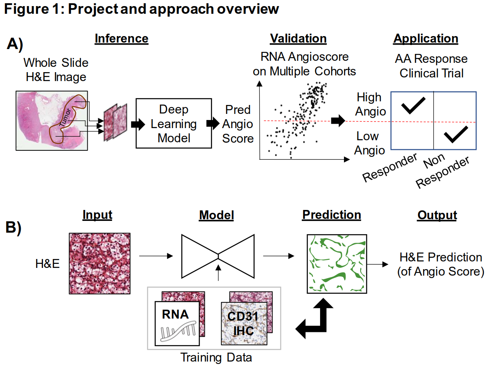

# Histopathology Based AI Model Predicts Anti-Angiogenic Therapy Response in Renal Cancer Clinical Trial 
Code for the paper "Histopathology Based AI Model Predicts Anti-Angiogenic Therapy Response in Renal Cancer Clinical Trial" by Jasti *et al* currently under review.

## Summary 

In this paper, we trained a deep learning model, that takes as input images of H&E stained ccRCC histopathologic slides, and outputs 

1. H&E DL AngioScore: a numerical value meant to approximate the expression of 7 angiogenesis  related genes  
2. Vascular Network: A binary mask covering the endothelial cells in the the image. The area of this network is basis of the H&E DL Angio score, and it therefore serves as an interpretable output for the model.

The model was trained using two datasets, the publicly available [TCGA KIRC](https://portal.gdc.cancer.gov/) (we make use of image patches as well as the RNA based AngioScore) and an internal UTSW dataset with H&E patches and matched ground truth vascular masks. 

The performance of the model was evaluated on several datasets, including multiple [TMA datasets](https://github.com/Rajaram-Lab/cancres-2022-intratumoral-heterogeneity-dl-paper/blob/master/www.figshare.com), an internal UTSW Cohort with RNA sequencing, an internal UTSW Cohort receiving TKI treatment and the IMmotion150 Clinical Trial. Using these datasets we demonstrate that our model:

1. Can reliably predict the RNA Angioscore
2. Can be used to explore the relationship of Angiogenesis with various clinical parameters
3. Can predict the response to Anti-Angiogenic therapy nearly as well as the ground truth RNA Angioscore

## Instructions:

The code provided here describes the preprocessing of data, the training of the H&E DL Angio model (and comparator models), evaluation on the different datasets and the generation of all figures in the paper as follows:

| Action               | Description                                                  | Documentation                         |
| -------------------- | ------------------------------------------------------------ | ------------------------------------- |
| 1. Data Generation | Code used to generate patches etc for Training/Inference | [Data](Data_Generation/README.md) |
| 2. Model Training   | Code used to train the H&E DL Angioscore model               | [Training](Model_Training/README.md) |
| 3. Model Evaluation | Code used for evaluating models                              | [Evaluation](Model_Evaluation/README.md) |
| 4. Figure Generation | Code used to generate Main and Supplementary figures in the paper | [Figures](Figures/README.md) |

### Sample Model Evaluation Script

To demonstrate use of the model, we provide an [example script](Model_Evaluation_Example.py)  which will will run inference on JPEG images of H&E files stored in a folder. To run this:

1. Download the model to your computer (will be released upon publication)

2. Activate an appropriate Conda environment as described in Software Notes below.

3. Navigate to the root folder when you have cloned this repo

4. Update the [[yaml file](Params/Eval_SampleImages.yaml)] providing the following paths. 

   `modelFile: "/$PATH_TO_FILE/MixedSimple_UNetResnet_E7.pt"`  
   `imageDir: "Images/SampleImages/"`  

   Currently  `imageDir` points to the sample H&E image patches included with this repository, but these can be replaced by images of your choosing.

5. Run the script as:

   `python Model_Evaluation_Example.py --yamlFile Params/Eval_SampleImages.yaml`

## Software Notes:

All code was written in Python, developed in a Conda environment and tested on a linux operating system running RedHat 7. Apart, from commonly used python packages, the code makes use of Pytorch (v2.0.1), lifelines, ImgAug and openslide.

## Citation

Citation to our paper once this is published....
